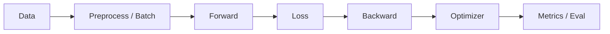

# 02. 统一训练框架思维

## 这份笔记的核心目标

CS231n 三份作业看起来覆盖了很多不同方法：

- kNN
- Softmax 分类器
- 两层网络 / MLP
- CNN
- RNN / captioning
- Transformer / ViT
- SimCLR / CLIP / DINO
- DDPM

但如果从工程和系统的角度去看，它们其实都可以放进同一个大框架里：

\[
\text{data} \to \text{model} \to \text{loss} \to \text{backward} \to \text{optimizer} \to \text{evaluation}
\]

这就是“统一训练框架思维”。

它的意义非常大，因为以后你遇到一个全新模型时，不需要从零开始，只需要问：

- 数据长什么样？
- forward 计算图长什么样？
- loss 在优化什么？
- 参数怎么更新？
- 推理时和训练时有什么不同？

## 一、三份作业其实在反复训练同一个流水线

### assignment1

assignment1 看起来是手写层、手写梯度、手写优化器，但本质仍然是：

1. 取 minibatch
2. 前向得到分数
3. 计算损失
4. 反向求梯度
5. 更新参数
6. 评估 train / val 性能

### assignment2

assignment2 引入 CNN、归一化、dropout、RNN，但大框架仍然不变，只是 `model.forward()` 更复杂了。

### assignment3

assignment3 进入 PyTorch 和现代模型，autograd 接管了手写 backward，但训练主循环仍然没变：

```python
for batch in loader:
    optimizer.zero_grad()
    loss = model_or_loss(batch)
    loss.backward()
    optimizer.step()
```

这说明真正应该记住的，不是每个模型的表面形式，而是背后的共同训练框架。

## 二、统一训练框架的 6 个基本环节

## 1. Data

数据阶段要解决的问题：

- 原始数据是什么类型？
- 如何组织成 batch？
- 是否需要增强、归一化、padding、tokenization？

在三份作业里分别表现为：

- CIFAR 图像读取与预处理
- caption 文本转 token
- SimCLR 的双增强视图
- CLIP 的图文对
- diffusion 的图像 + 文本条件

可以抽象成：

\[
\mathcal{D} = \{(x_i, y_i)\}_{i=1}^N
\]

或者更一般地：

\[
\mathcal{D} = \{(\text{input}_i, \text{target}_i, \text{metadata}_i)\}
\]

## 2. Model Forward

这一层决定“给定输入，模型如何生成中间表示和输出”。

分类里：

\[
x \to f_\theta(x) \to scores
\]

captioning 里：

\[
(\text{image}, \text{caption prefix}) \to f_\theta \to \text{next-token logits}
\]

diffusion 里：

\[
(x_t, t, cond) \to \epsilon_\theta(x_t, t, cond)
\]

所以 forward 本质上是：

\[
\text{prediction} = f_\theta(\text{input})
\]

## 3. Loss

loss 决定模型在学什么。

不同任务只是 loss 不同：

- 分类：cross entropy
- 序列预测：temporal softmax loss
- 对比学习：InfoNCE
- 检索：相似度匹配
- diffusion：噪声预测 MSE

这一层是整个训练框架里最容易被忽视，但最本质的一层。

很多时候“方法不同”不在于主干网络，而在于优化目标变了。

## 4. Backward

assignment1 和 assignment2 前半段手写 backward，帮助你真正理解链式法则：

\[
\frac{\partial L}{\partial x}
=
\frac{\partial L}{\partial y}
\frac{\partial y}{\partial x}
\]

assignment3 交给 autograd，但逻辑没变。只是梯度的实现从“手工写”变成“由框架记录计算图并自动求导”。

所以 backward 不是一个额外模块，而是 forward 的镜像。

## 5. Optimizer Update

有了梯度之后，优化器负责真正更新参数：

\[
\theta \leftarrow \theta - \eta \nabla_\theta L
\]

更现代的版本会用动量、自适应学习率等机制。

在代码层面，你应该把它理解成：

- model 负责“提供参数和梯度”
- optimizer 负责“根据梯度改参数”

## 6. Evaluation

评估不是训练的附属品，而是训练闭环的一部分。

你要始终区分：

- train performance
- validation performance
- test performance
- 真实任务性能

在不同任务中，评估指标不同：

- 分类：accuracy
- captioning：loss、生成样例、语言质量
- 检索：top-k retrieval
- 分割：IoU
- 生成：样本质量与多样性

## 三、你应该学会把任何任务都映射到这张图



这张图是你以后学任何深度学习系统时都可以先拿出来的“母版”。

## 四、assignment1 到 assignment3 的框架升级

### 1. assignment1：显式理解每一层

这一阶段，你看到的是：

- 每层 forward / backward 明确分开
- `cache` 保存中间量
- `Solver` 外部管理训练过程

这一阶段训练的是：

- 把模型拆成可组合层
- 把训练过程和模型实现分离

### 2. assignment2：模块组合和网络扩展

这一阶段开始出现：

- `conv_relu_pool_forward`
- `affine_bn_relu_forward`
- `dropout_forward`
- `rnn_forward`

也就是说，你开始学会把“小层”拼成“模块块”，再拼成整个网络。

### 3. assignment3：现代框架化

这一阶段的关键变化是：

- 手写梯度减少
- `nn.Module` 成为核心组织单元
- `Dataset` / `DataLoader` / `Trainer` 更清晰
- loss 与 model 可以解耦

这就是现代深度学习工程的基础组织方式。

## 五、统一训练框架里最关键的“边界意识”

读和写模型时，要习惯问：这个功能属于哪一层？

### 数据层负责什么

- 读文件
- 预处理
- 数据增强
- 打包 batch

### 模型层负责什么

- 定义参数
- 定义 forward 图
- 产生预测

### loss 层负责什么

- 把预测和目标比较成可优化标量

### 优化器负责什么

- 根据梯度更新参数

### trainer / solver 负责什么

- 组织训练循环
- 记录日志
- 做验证
- 保存最佳模型

这个边界意识非常重要。很多代码一旦难读，通常就是这些层次混在一起了。

## 六、两套你必须熟悉的训练模板

### 模板一：NumPy 手写训练模板

```python
for it in range(num_iters):
    X_batch, y_batch = sample_batch(X_train, y_train, batch_size)
    loss, grads = model.loss(X_batch, y_batch)

    for p in model.params:
        model.params[p] = model.params[p] - learning_rate * grads[p]
```

你需要看懂：

- `loss()` 同时返回损失和梯度
- 参数通常保存在 `model.params`
- optimizer 的“状态”可能额外存在外部配置字典里

### 模板二：PyTorch 训练模板

```python
for batch in loader:
    optimizer.zero_grad()
    loss = compute_loss(model, batch)
    loss.backward()
    optimizer.step()
```

你需要看懂：

- 梯度累计在参数对象上，所以每轮先 `zero_grad()`
- `loss.backward()` 会沿计算图自动反传
- `optimizer.step()` 用当前梯度更新参数

## 七、训练态和测试态为什么必须分开

这是统一训练框架中一个很容易被低估的点。

很多层在训练和测试时行为不一样：

- BatchNorm：训练时用 batch 统计量，测试时用 running 统计量
- Dropout：训练时随机屏蔽，测试时不屏蔽
- 自回归生成：训练时 teacher forcing，推理时逐步解码
- diffusion：训练时随机采一个时间步做噪声回归，采样时从纯噪声倒序迭代

所以你要形成一个很强的习惯：

> 每学一个模型，都问自己：它的训练图和推理图一样吗？

如果不一样，要把两条路径分开画出来。

## 八、loss 才是真正的任务定义

一个非常重要的抽象是：

同一个 backbone，配不同 loss，学到的东西可能完全不同。

例如：

- ResNet 做 supervised classification
- ResNet 做 SimCLR encoder
- ViT 做分类
- ViT / DINO backbone 做 dense patch 特征

所以以后看新方法时，建议优先问：

- backbone 是什么？
- loss 是什么？
- 正样本、负样本或条件是什么？
- 推理阶段实际取什么输出？

## 九、你可以如何用这套框架读新论文或新项目

遇到一个新模型，不要被名词吓到。先用下面这张表拆解：

| 问题 | 你要找的答案 |
| --- | --- |
| 数据是什么 | 图像、文本、图文对、视频、token、噪声图像？ |
| 输入如何组织 | shape、batch、padding、mask、augmentation |
| 模型 forward 是什么 | 编码器、解码器、cross-attention、U-Net？ |
| loss 是什么 | 交叉熵、MSE、对比损失、蒸馏损失？ |
| 优化方式是什么 | SGD、Adam、学习率调度、warmup？ |
| 评估方式是什么 | accuracy、BLEU、IoU、FID、检索召回？ |
| 训练态和推理态有何不同 | teacher forcing、sampling、dropout、BN？ |

只要这张表能填出来，哪怕实现细节还没全部搞懂，你也已经抓住了主干。

## 十、建议你如何把这份能力练成自己的直觉

### 方法一：每见一个新代码文件，先问它属于哪层

例如：

- `dataset.py`：数据层
- `model.py`：模型层
- `loss.py`：目标层
- `trainer.py`：训练循环层
- `optim.py`：参数更新层

### 方法二：强迫自己写“一行版摘要”

例如：

- “这是一个图像到类别的判别模型”
- “这是一个图像和文本拉到同一空间的对比模型”
- “这是一个预测噪声以实现逆扩散采样的条件生成模型”

### 方法三：每学一个模型，都把训练流程写成 5 行伪代码

这能强迫你抓住本质，而不是沉迷于局部实现。

## 最后一句总结

统一训练框架思维会把“很多零散算法”变成“同一条流水线上的不同变体”。

当你真正掌握它之后，再遇到新模型时，你不会觉得“这又是一个完全陌生的东西”，而会自然地想：

> 它的数据是什么，它的 forward 是什么，它的 loss 是什么，它和我已经见过的训练闭环有什么不同？
