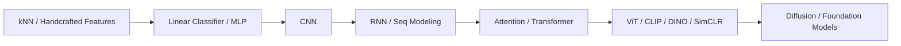

# 10. 从 CS231n 作业到现代基础模型的桥梁

## 为什么这一篇很值得写

很多人学完基础课程后，会有一种断裂感：

- 课程里学的是 kNN、Softmax、CNN、RNN
- 业界和论文里讨论的是 GPT、ViT、CLIP、DINO、Diffusion、VLM

于是就容易产生一个错觉：

> 基础课学的东西是不是已经过时了？

其实恰恰相反。现代基础模型并不是凭空出现的，它们是在这些基础思想上一路演化出来的。

CS231n 三份作业，已经把这条演化链上的很多关键节点都碰到了。

这份笔记的目标，就是帮你把这些点连成一条线，建立“从课程到现代模型”的桥梁感。

## 一、一条非常重要的演化主线

你可以把这门课学到的内容粗略画成这样：

这不是严格历史时间线，但非常适合作为理解路线。

## 二、assignment1：为什么它没有过时

assignment1 讲的是：

- 线性分类器
- softmax loss
- MLP
- 优化器
- 手写 forward / backward

这些内容看起来最“基础”，但它们在现代模型里一点也没有消失。

### 1. 线性头从未消失

几乎所有现代模型最后都还会接一个线性头：

- 分类头
- language modeling head
- projection head
- diffusion 输出头

### 2. MLP 从未消失

Transformer block 里的 FFN，本质上还是 MLP。

### 3. softmax 从未消失

语言模型、分类器、检索匹配、注意力权重，都在大量使用 softmax 或其变体。

### 4. 链式法则从未消失

虽然你以后不常手写 backward，但理解梯度流仍然是调试和设计模型的基础。

所以 assignment1 是现代模型的“语法基础”。

## 三、assignment2：为什么 CNN 和序列建模仍然是桥梁

assignment2 里最关键的两条线是：

- CNN
- RNN / 序列模型

### 1. CNN 仍然是视觉归纳偏置的重要来源

即使在 ViT 时代，CNN 的思想仍然很关键：

- 局部模式提取
- 空间层级表示
- 多尺度特征

U-Net、现代视觉 backbone、中间 token mixer，很多地方仍保留卷积思想。

### 2. RNN 虽然主角地位下降，但序列思维没有消失

RNN 给你的真正训练是：

- 序列有时间结构
- 训练和推理可能不同
- 条件生成是一步步进行的

这些思想在 Transformer 和语言模型中完全保留下来了，只是交互机制从递归改成了注意力。

也就是说：

> RNN 可能不是最终形态，但序列建模思维是永恒的。

## 四、assignment3：你已经摸到了现代基础模型的入口

assignment3 其实是整个课程中最直接通向现代模型的一部分。

## 1. Transformer / ViT

这直接连接到：

- GPT 类语言模型
- BERT 类编码器模型
- ViT 类视觉模型
- 多模态 Transformer

你在作业里已经接触了其中最核心的积木：

- token embedding
- positional encoding
- self-attention
- multi-head attention
- feed-forward block
- decoder 结构

这些就是现代大模型的骨架。

## 2. SimCLR / CLIP / DINO

这条线直接连接到现代表示学习和多模态基础模型：

- 对比学习
- 对齐式预训练
- 无监督 / 自监督表征学习
- zero-shot 能力

你可以把它们理解成“现代 foundation model 的预训练哲学原型”。

## 3. DDPM

这条线直接连接到：

- 文生图模型
- 图像编辑模型
- 视频生成模型
- latent diffusion

你在作业里虽然做的是简化版，但核心思想已经接上了真实前沿。

## 五、从课程概念到现代大模型概念的映射

下面这张映射表很值得长期记住。

| 课程中的概念 | 现代基础模型中的对应 |
| --- | --- |
| affine / MLP | transformer FFN、head、projector |
| softmax | 分类输出、LM 输出、attention 归一化 |
| word embedding | token embedding、position embedding、prompt embedding |
| CNN feature map | visual tokens、multi-scale features |
| RNN hidden state | autoregressive context state |
| attention | Transformer、LLM、VLM 的核心交互机制 |
| contrastive loss | CLIP、检索式预训练、对齐学习 |
| denoising | diffusion、去噪式生成、score-based models |
| solver / trainer | 现代训练基础设施 |

一旦这样映射，你就会发现基础课程没有断掉，而是在延伸。

## 六、现代基础模型真正新增了什么

基础课程当然不是全部。现代 foundation model 在很多方面做了显著扩展：

### 1. 数据规模

- 从小型课程数据集到海量互联网数据

### 2. 模型规模

- 从几层网络到几十上百层、数十亿参数

### 3. 训练目标复杂度

- 从单任务监督，到多任务、自监督、跨模态联合目标

### 4. 工程系统复杂度

- 分布式训练
- 混合精度
- 大规模数据管道
- checkpoint / sharding / serving

### 5. 预训练与微调范式

- 先学通用表示，再迁移到具体任务

但注意：

这些变化大多是“在基础概念之上扩展”，不是完全替换基础概念。

## 七、你已经从这些作业里获得了哪些可迁移到大模型时代的能力

非常多，而且很实用：

### 1. 看懂张量维度

LLM、VLM、diffusion 都离不开 shape 思维。

### 2. 理解训练闭环

不管模型多大，都是：

- data
- forward
- loss
- backward
- update

### 3. 理解模块组合

现代模型依然是 block-based 设计。

### 4. 理解表示学习

大模型很多时候的本质就是：

- 学更强、更通用、更可迁移的表示

### 5. 理解生成与判别

这会帮助你理解：

- 为什么 GPT 和 CLIP 看起来完全不同
- 为什么 diffusion 和 classifier 的推理方式差很多

### 6. 理解数值稳定与工程约束

模型越大，这些问题只会更重要，不会更不重要。

## 八、如果你想继续往现代模型走，下一步最值得补什么

在已经做完这三份作业的基础上，可以考虑沿下面这些方向继续学：

### 1. 语言模型方向

- Transformer encoder / decoder 更完整细节
- causal language modeling
- masked language modeling
- KV cache
- tokenization

### 2. 视觉表示方向

- ResNet
- ViT 更完整训练策略
- MAE
- DINOv2

### 3. 多模态方向

- CLIP 扩展
- vision-language model
- cross-attention
- instruction tuning

### 4. 生成模型方向

- DDIM
- latent diffusion
- classifier-free guidance 更深入
- 条件控制与编辑

### 5. 工程方向

- mixed precision
- distributed training
- experiment tracking
- model serving

## 九、你应该如何避免“只会基础，不会迁移”

一个很好的做法是：每学一个现代概念，都问自己它在 CS231n 里对应什么原型。

例如：

- `Transformer FFN` 对应 assignment1 的 MLP
- `ViT patch embedding` 对应 assignment3 的 patchify + linear projection
- `CLIP` 对应对比学习 + 相似度空间
- `diffusion guidance` 对应条件建模和概率引导
- `language modeling head` 对应 softmax 分类头在词表上的扩展

这样你会发现，新知识不是孤立碎片，而是在旧知识上长出来的分支。

## 十、一个很重要的心态：基础不是“低级版本”，而是“可迁移语法”

这是最值得保留的一点。

你做这些作业学到的，不只是某个特定时代流行的模型，而是一整套可以迁移的语法：

- 张量语法
- 模块语法
- 训练语法
- 表示学习语法
- 生成与判别语法

真正厉害的人，不是因为背了很多模型名，而是因为这些“语法”已经内化了。

## 最后一句总结

从 CS231n 到现代基础模型，并不是一条断裂的路，而是一条连续演化的路。

当你能把课程里的每个概念都找到它在现代模型中的延伸位置时，你就不再只是“学过一门课”，而是在建立一张能不断吸收新知识的长期地图。
