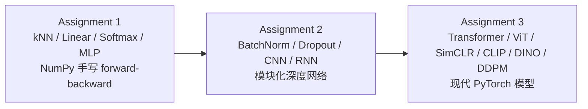
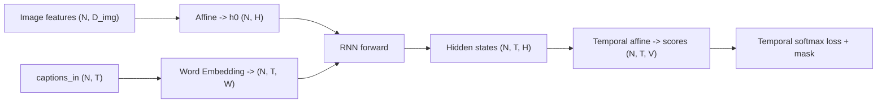
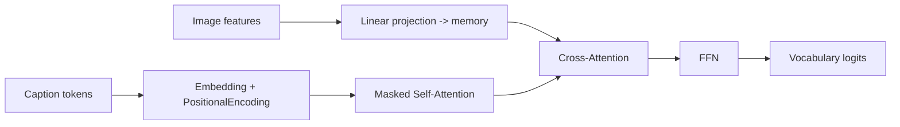
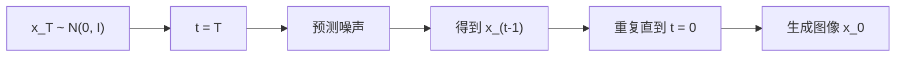
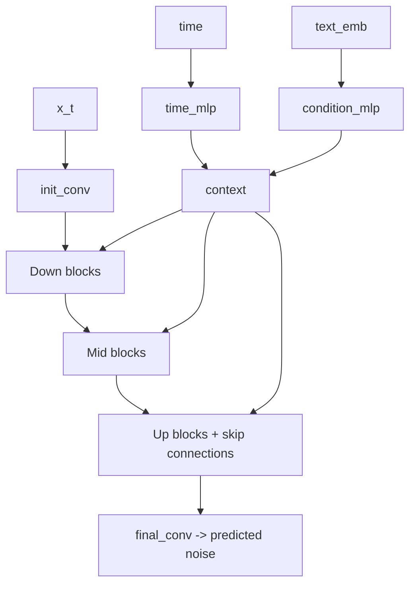

# CS231n Assignments Study Summary

这份文档是基于 `/Users/wrx/Desktop/learn` 里的三份作业源码整理出来的总学习笔记。它不是简单的 notebook 回顾，而是把三份作业里出现的主要方法，按“方法”而不是按零散文件，统一总结成一张方法地图。

目标是把每一种方法都压缩成四个问题：

1. 这个方法的核心逻辑是什么，数学上在做什么
2. 这个方法在代码里是怎么组织的，类、函数、张量维度是什么
3. 这个方法最核心的代码模板是什么
4. 这个方法常见的工程问题和调试要点是什么

---

## 1. 总体地图

这三份作业本质上是一条很清楚的演化链：



如果把这条线压成一句话：

- `assignment1` 学的是“把数学公式翻译成矩阵代码”
- `assignment2` 学的是“把层封装成模块，再拼成系统”
- `assignment3` 学的是“把现代目标函数和现代网络组织成完整模型”

统一记号：

- \(N\): batch size
- \(D\): 输入特征维度
- \(H\): hidden dimension
- \(C\): 类别数
- \(T\): 序列长度或扩散时间步
- \(V\): 词表大小
- \(F\): 卷积核个数
- \(P\): patch size

统一代码视角：


---

## 2. 统一训练框架

在这套 `cs231n` 作业代码里，几乎所有方法都能被看成下面几种母版之一。

### 2.1 判别式监督学习模板

适用方法：

- Softmax 分类器
- TwoLayerNet / FullyConnectedNet
- ConvNet
- ViT 分类
- DINO 线性 probe

数学形式：

$$
\text{scores} = f_\theta(x)
$$

$$
L = \mathcal{L}(\text{scores}, y) + R(\theta)
$$

代码模板：

```python
scores = model.forward(x)
loss, dscores = loss_fn(scores, y)
loss += reg_term
grads = model.backward(dscores)
update(params, grads)
```

---

### 2.2 自回归序列生成模板

适用方法：

- RNN Captioning
- Transformer Captioning

数学形式：

$$
p(w_1, \dots, w_T \mid image)
= \prod_{t=1}^{T} p(w_t \mid w_{<t}, image)
$$

代码模板：

```python
state_or_memory = init_from_image(features)
token = START

for t in range(max_length):
    token_emb = embed(token)
    state = step(token_emb, state_or_memory)
    logits = vocab_head(state)
    token = argmax(logits)
```

---

### 2.3 对比学习模板

适用方法：

- SimCLR
- 理解 CLIP 的对比式思想时也很有帮助

数学形式：

$$
x \xrightarrow{\text{aug}_1} x_i,\qquad
x \xrightarrow{\text{aug}_2} x_j
$$

$$
z_i = f_\theta(x_i),\qquad z_j = f_\theta(x_j)
$$

$$
\text{让正样本对相似，让负样本对不相似}
$$

代码模板：

```python
x_i, x_j = aug(x), aug(x)
z_i = normalize(projector(encoder(x_i)))
z_j = normalize(projector(encoder(x_j)))
loss = contrastive_loss(z_i, z_j, tau)
```

---

### 2.4 扩散生成模板

适用方法：

- DDPM
- 条件扩散
- Classifier-Free Guidance

数学形式：

前向加噪：

$$
x_t = \sqrt{\bar\alpha_t}x_0 + \sqrt{1-\bar\alpha_t}\epsilon,\qquad
\epsilon \sim \mathcal{N}(0, I)
$$

反向去噪：

$$
x_t \to x_{t-1} \to \cdots \to x_0
$$

代码模板：

```python
# train
t = sample_random_t()
noise = randn_like(x0)
x_t = q_sample(x0, t, noise)
pred_noise = denoiser(x_t, t, cond)
loss = mse(pred_noise, noise)

# sample
x = randn(...)
for t in reversed(range(T)):
    pred_noise = denoiser(x, t, cond)
    x = reverse_step(x, pred_noise, t)
```

---

## 3. Assignment 1

源码核心位置：

- `/Users/wrx/Desktop/learn/assignment1/cs231n/classifiers/k_nearest_neighbor.py`
- `/Users/wrx/Desktop/learn/assignment1/cs231n/classifiers/linear_classifier.py`
- `/Users/wrx/Desktop/learn/assignment1/cs231n/classifiers/softmax.py`
- `/Users/wrx/Desktop/learn/assignment1/cs231n/classifiers/fc_net.py`
- `/Users/wrx/Desktop/learn/assignment1/cs231n/layers.py`
- `/Users/wrx/Desktop/learn/assignment1/cs231n/features.py`
- `/Users/wrx/Desktop/learn/assignment1/cs231n/solver.py`
- `/Users/wrx/Desktop/learn/assignment1/cs231n/optim.py`

---

### 3.1 k-Nearest Neighbor

代码位置：

- `/Users/wrx/Desktop/learn/assignment1/cs231n/classifiers/k_nearest_neighbor.py`

#### 3.1.1 核心逻辑

kNN 是最典型的非参数方法。

“训练”不是真的优化参数，而只是把训练集记住。预测时，对每个测试样本 \(x\)，去训练集里找最近的 \(k\) 个样本，让它们投票。

欧氏距离：

$$
d(x, x_i) = \|x - x_i\|_2
$$

预测标签：

$$
\hat y = \mathrm{mode}\{y_{(1)}, y_{(2)}, \dots, y_{(k)}\}
$$

直觉上：

- 离得近的样本更可能属于同一类
- 决策边界不是显式学出来的，而是由训练样本的分布隐式决定

#### 3.1.2 代码框架

类：`KNearestNeighbor`

主要函数：

- `train(X, y)`: 只保存训练数据
- `predict(X, k, num_loops)`: 预测入口
- `compute_distances_two_loops(X)`: 双循环版本
- `compute_distances_one_loop(X)`: 单循环版本
- `compute_distances_no_loops(X)`: 向量化版本
- `predict_labels(dists, k)`: 根据距离矩阵投票

维度：

$$
X_{\text{train}} \in \mathbb{R}^{N_{\text{train}} \times D}
$$

$$
X_{\text{test}} \in \mathbb{R}^{N_{\text{test}} \times D}
$$

$$
dists \in \mathbb{R}^{N_{\text{test}} \times N_{\text{train}}}
$$

#### 3.1.3 核心模板

向量化距离公式：

$$
\|x-y\|_2^2 = \|x\|_2^2 + \|y\|_2^2 - 2x^\top y
$$

代码模板：

```python
X_sq = np.sum(X_test ** 2, axis=1, keepdims=True)
train_sq = np.sum(X_train ** 2, axis=1, keepdims=True).T
cross = X_test @ X_train.T
dists = np.sqrt(X_sq + train_sq - 2 * cross)

nearest = np.argsort(dists[i])[:k]
closest_y = y_train[nearest]
pred = np.argmax(np.bincount(closest_y))
```

#### 3.1.4 工程注意

- `sqrt` 前的值可能因数值误差出现极小负数，工程里常 `np.maximum(val, 0)`
- 距离矩阵太大时会爆内存，需要分块计算
- 高维下距离会退化，kNN 通常要搭配特征工程或降维
- `k` 太小容易过拟合，`k` 太大容易过平滑

---

### 3.2 线性分类器：Softmax 和 SVM

代码位置：

- `/Users/wrx/Desktop/learn/assignment1/cs231n/classifiers/linear_classifier.py`
- `/Users/wrx/Desktop/learn/assignment1/cs231n/classifiers/softmax.py`
- `/Users/wrx/Desktop/learn/assignment1/cs231n/layers.py`

#### 3.2.1 核心逻辑

线性分类器把每个类别的分数写成输入特征的线性函数：

$$
S = XW + b
$$

其中：

$$
X \in \mathbb{R}^{N \times D},\qquad
W \in \mathbb{R}^{D \times C},\qquad
S \in \mathbb{R}^{N \times C}
$$

##### Softmax

先把分数变成概率：

$$
p_{ic} = \frac{e^{s_{ic}}}{\sum_{j=1}^{C} e^{s_{ij}}}
$$

交叉熵损失：

$$
L = -\frac{1}{N}\sum_{i=1}^{N}\log p_{i,y_i} + \frac{\lambda}{2}\|W\|_F^2
$$

##### Multiclass SVM

每个错误类都要比正确类低一个 margin：

$$
L_i = \sum_{j \ne y_i} \max(0, s_{ij} - s_{i,y_i} + 1)
$$

总损失：

$$
L = \frac{1}{N}\sum_i L_i + \frac{\lambda}{2}\|W\|_F^2
$$

#### 3.2.2 代码框架

类：

- `LinearClassifier`
- `LinearSVM(LinearClassifier)`
- `Softmax(LinearClassifier)`

主要函数：

- `train(X, y, learning_rate, reg, num_iters, batch_size)`
- `predict(X)`
- `loss(X_batch, y_batch, reg)`

你的代码里，`LinearClassifier.train` 做了三件事：

1. 采样 minibatch
2. 调用 `self.loss`
3. 用梯度更新 `self.W`

维度：

$$
X \in \mathbb{R}^{N \times D},\quad
y \in \{0,\dots,C-1\}^N,\quad
W \in \mathbb{R}^{D \times C}
$$

#### 3.2.3 核心模板

Softmax 向量化模板：

```python
scores = X @ W
scores -= scores.max(axis=1, keepdims=True)
probs = np.exp(scores) / np.exp(scores).sum(axis=1, keepdims=True)

loss = -np.log(probs[np.arange(N), y]).mean()
loss += 0.5 * reg * np.sum(W * W)

dscores = probs.copy()
dscores[np.arange(N), y] -= 1
dscores /= N
dW = X.T @ dscores + reg * W
```

训练模板：

```python
batch_idx = np.random.choice(num_train, batch_size, replace=True)
X_batch = X[batch_idx]
y_batch = y[batch_idx]

loss, grad = self.loss(X_batch, y_batch, reg)
self.W -= learning_rate * grad
```

#### 3.2.4 工程注意

- Softmax 一定先减去每行最大值，否则 `exp` 会溢出
- `y` 必须是类别索引，不是 one-hot
- 正则化项常写成 `0.5 * reg * ||W||^2`，因为梯度正好是 `reg * W`
- 线性分类器表达能力有限，但非常适合作为基线和调参起点

---

### 3.3 手工特征：HOG 和颜色直方图

代码位置：

- `/Users/wrx/Desktop/learn/assignment1/cs231n/features.py`

#### 3.3.1 核心逻辑

这部分的思想是：

- 先用人为设计的映射 \(\phi(x)\) 从像素提特征
- 再在特征空间里做线性分类

即：

$$
x \mapsto \phi(x)
$$

$$
\hat y = \arg\max_c \phi(x)^\top w_c
$$

HOG 强调局部边缘方向信息，颜色直方图强调全局色调统计。

#### 3.3.2 代码框架

主要函数：

- `extract_features(imgs, feature_fns)`
- `hog_feature(im)`
- `color_histogram_hsv(im, ...)`

维度：

$$
imgs \in \mathbb{R}^{N \times H \times W \times C}
$$

若特征函数输出维度分别为 \(F_1, F_2, \dots\)，则：

$$
\Phi \in \mathbb{R}^{N \times (F_1 + F_2 + \cdots)}
$$

#### 3.3.3 核心模板

```python
hog = hog_feature(img)
color = color_histogram_hsv(img)
feat = np.hstack([hog, color])
```

#### 3.3.4 工程注意

- 图像通道顺序必须统一
- 特征拼接后最好标准化
- HOG 的 cell 大小和方向 bin 数很重要
- 手工特征通常适合小数据和低算力场景

---

### 3.4 TwoLayerNet 和 FullyConnectedNet

代码位置：

- `/Users/wrx/Desktop/learn/assignment1/cs231n/classifiers/fc_net.py`
- `/Users/wrx/Desktop/learn/assignment1/cs231n/layers.py`

#### 3.4.1 核心逻辑

MLP 的本质是线性变换加非线性。

两层网络：

$$
h = \mathrm{ReLU}(XW_1 + b_1)
$$

$$
scores = hW_2 + b_2
$$

$$
L = \mathrm{SoftmaxLoss}(scores, y) + \frac{\lambda}{2}\left(\|W_1\|_F^2 + \|W_2\|_F^2\right)
$$

多层网络只是把这个 block 叠起来：

$$
\text{affine} \to \text{ReLU} \to \text{affine} \to \text{ReLU} \to \cdots \to \text{affine}
$$

#### 3.4.2 代码框架

基础层函数：

- `affine_forward / affine_backward`
- `relu_forward / relu_backward`
- `softmax_loss`

组合函数：

- `affine_relu_forward`
- `affine_relu_backward`

网络类：

- `TwoLayerNet`
- `FullyConnectedNet`

`self.params` 是全局参数表：

- `W1, b1`
- `W2, b2`
- ...

维度例子：

$$
X \in \mathbb{R}^{N \times D}
$$

$$
W_1 \in \mathbb{R}^{D \times H},\qquad
b_1 \in \mathbb{R}^{H}
$$

$$
W_2 \in \mathbb{R}^{H \times C},\qquad
b_2 \in \mathbb{R}^{C}
$$

#### 3.4.3 核心模板

两层网络模板：

```python
hidden, cache_hidden = affine_relu_forward(X, W1, b1)
scores, cache_scores = affine_forward(hidden, W2, b2)

loss, dscores = softmax_loss(scores, y)
loss += 0.5 * reg * (np.sum(W1 * W1) + np.sum(W2 * W2))

dhidden, dW2, db2 = affine_backward(dscores, cache_scores)
dx, dW1, db1 = affine_relu_backward(dhidden, cache_hidden)

dW2 += reg * W2
dW1 += reg * W1
```

深层网络模板：

```python
out = X
caches = {}

for i in range(1, L):
    out, caches[i] = affine_relu_forward(out, W[i], b[i])

scores, caches[L] = affine_forward(out, W[L], b[L])
loss, dout = softmax_loss(scores, y)

for i in reversed(range(1, L + 1)):
    ...
```

#### 3.4.4 工程注意

- `affine_forward` 一定要先 reshape 到 `(N, D)`
- `affine_backward` 一定要 reshape 回原输入形状
- ReLU backward 就是把 `x <= 0` 的位置梯度清零
- forward 里缓存什么，backward 就必须依赖什么
- 深层网络越来越难训练，这就是 assignment2 要引入 BN 和 Dropout 的动机

---

### 3.5 Assignment 1 的训练系统

代码位置：

- `/Users/wrx/Desktop/learn/assignment1/cs231n/solver.py`
- `/Users/wrx/Desktop/learn/assignment1/cs231n/optim.py`

#### 3.5.1 核心逻辑

`Solver` 的思想很重要：

- 模型只负责 `loss(X, y)`
- 训练流程由外部 `Solver` 统一管理

这让“模型结构”和“优化过程”解耦。

常见优化器：

##### SGD

$$
w_{t+1} = w_t - \eta g_t
$$

##### Momentum

$$
v_{t+1} = \mu v_t - \eta g_t
$$

$$
w_{t+1} = w_t + v_{t+1}
$$

##### RMSProp

$$
s_{t+1} = \rho s_t + (1-\rho)g_t^2
$$

$$
w_{t+1} = w_t - \eta \frac{g_t}{\sqrt{s_{t+1}} + \epsilon}
$$

##### Adam

$$
m_{t+1} = \beta_1 m_t + (1-\beta_1)g_t
$$

$$
v_{t+1} = \beta_2 v_t + (1-\beta_2)g_t^2
$$

再做偏差修正。

#### 3.5.2 代码框架

`Solver.train` 的本质：

1. 采样 batch
2. 计算 `loss, grads`
3. 对每个参数调用 `update_rule`
4. 记录 loss 和准确率

#### 3.5.3 核心模板

```python
X_batch, y_batch = sample_batch(...)
loss, grads = model.loss(X_batch, y_batch)

for p in model.params:
    w = model.params[p]
    dw = grads[p]
    model.params[p], optim_configs[p] = update_rule(w, dw, optim_configs[p])
```

#### 3.5.4 工程注意

- 每个参数都有独立优化状态
- `float64` 更适合数值梯度检查
- 验证集准确率比训练 loss 更能说明泛化
- `gradient_check.py` 在 NumPy 手写网络里几乎是必需品

---

## 4. Assignment 2

源码核心位置：

- `/Users/wrx/Desktop/learn/assignment2/cs231n/classifiers/cnn.py`
- `/Users/wrx/Desktop/learn/assignment2/cs231n/classifiers/fc_net.py`
- `/Users/wrx/Desktop/learn/assignment2/cs231n/layers.py`
- `/Users/wrx/Desktop/learn/assignment2/cs231n/layer_utils.py`
- `/Users/wrx/Desktop/learn/assignment2/cs231n/classifiers/rnn_pytorch.py`
- `/Users/wrx/Desktop/learn/assignment2/cs231n/rnn_layers_pytorch.py`
- `/Users/wrx/Desktop/learn/assignment2/cs231n/captioning_solver_pytorch.py`

---

### 4.1 BatchNorm 和 LayerNorm

代码位置：

- `/Users/wrx/Desktop/learn/assignment2/cs231n/layers.py`
- `/Users/wrx/Desktop/learn/assignment2/cs231n/layer_utils.py`
- `/Users/wrx/Desktop/learn/assignment2/cs231n/classifiers/fc_net.py`

#### 4.1.1 核心逻辑

BatchNorm 的目标是让每个特征维在训练过程中保持更稳定的分布。

BatchNorm：

$$
\mu_B = \frac{1}{N}\sum_{i=1}^{N}x_i,\qquad
\sigma_B^2 = \frac{1}{N}\sum_{i=1}^{N}(x_i-\mu_B)^2
$$

$$
\hat x_i = \frac{x_i-\mu_B}{\sqrt{\sigma_B^2+\epsilon}}
$$

$$
y_i = \gamma \hat x_i + \beta
$$

LayerNorm 公式相同，但统计均值和方差的轴不同：

- BatchNorm: 按 batch 维度统计
- LayerNorm: 按单个样本自己的特征维统计

#### 4.1.2 代码框架

在全连接网络里，一个 hidden block 从

`affine -> relu`

变成

`affine -> [norm] -> relu -> [dropout]`

新增参数：

- `gamma{i}`
- `beta{i}`

维度：

$$
x \in \mathbb{R}^{N \times D},\qquad
\gamma,\beta \in \mathbb{R}^{D}
$$

#### 4.1.3 核心模板

```python
mean = np.mean(x, axis=0)
var = np.var(x, axis=0)
x_hat = (x - mean) / np.sqrt(var + eps)
out = gamma * x_hat + beta
```

LayerNorm 模板：

```python
mean = np.mean(x, axis=1, keepdims=True)
var = np.var(x, axis=1, keepdims=True)
x_hat = (x - mean) / np.sqrt(var + eps)
out = gamma * x_hat + beta
```

#### 4.1.4 工程注意

- BN 必须维护 `running_mean` 和 `running_var`
- BN 的 `train/test` 模式一定要区分
- LN 没有 running statistics，train/test 行为一致
- `gamma/beta` 不做 L2 正则
- 归一化轴和广播维度最容易写错

---

### 4.2 Dropout

代码位置：

- `/Users/wrx/Desktop/learn/assignment2/cs231n/layers.py`
- `/Users/wrx/Desktop/learn/assignment2/cs231n/classifiers/fc_net.py`

#### 4.2.1 核心逻辑

Dropout 在训练时随机屏蔽一部分神经元，防止网络过度依赖某些局部模式。

Inverted dropout：

$$
m_j \sim \mathrm{Bernoulli}(p)
$$

$$
\tilde h = \frac{m \odot h}{p}
$$

这样测试阶段就不需要缩放。

#### 4.2.2 代码框架

主要函数：

- `dropout_forward`
- `dropout_backward`

在 `FullyConnectedNet.loss` 里，它被放在 ReLU 后面。

#### 4.2.3 核心模板

```python
mask = (np.random.rand(*x.shape) < p) / p
out = x * mask

dx = dout * mask
```

#### 4.2.4 工程注意

- train/test 模式必须切换
- gradient check 时常设置固定随机种子
- dropout 太强会明显欠拟合
- BN 和 dropout 同时用时，超参数更敏感

---

### 4.3 卷积层和池化层

代码位置：

- `/Users/wrx/Desktop/learn/assignment2/cs231n/layers.py`
- `/Users/wrx/Desktop/learn/assignment2/cs231n/layer_utils.py`

#### 4.3.1 核心逻辑

卷积的核心思想是：

- 局部感受野
- 权重共享
- 对空间平移更稳定

卷积前向：

$$
y_{n,f,i,j} = \sum_{c,u,v} x_{n,c,i+u,j+v}w_{f,c,u,v} + b_f
$$

最大池化：

$$
y_{n,c,i,j} = \max_{(u,v)\in \text{window}} x_{n,c,i+u,j+v}
$$

#### 4.3.2 代码框架

主要函数：

- `conv_forward_naive`
- `conv_backward_naive`
- `max_pool_forward_naive`
- `max_pool_backward_naive`

组合模块：

- `conv_relu_forward`
- `conv_relu_pool_forward`
- `conv_relu_pool_backward`

维度：

$$
x \in \mathbb{R}^{N \times C \times H \times W}
$$

$$
w \in \mathbb{R}^{F \times C \times HH \times WW}
$$

$$
out \in \mathbb{R}^{N \times F \times H' \times W'}
$$

其中：

$$
H' = 1 + \frac{H + 2\cdot pad - HH}{stride}
$$

$$
W' = 1 + \frac{W + 2\cdot pad - WW}{stride}
$$

#### 4.3.3 核心模板

卷积前向模板：

```python
for n in range(N):
    for f in range(F):
        for i in range(H_out):
            for j in range(W_out):
                window = x_pad[n, :, h_start:h_end, w_start:w_end]
                out[n, f, i, j] = np.sum(window * w[f]) + b[f]
```

池化前向模板：

```python
window = x[n, c, h_start:h_end, w_start:w_end]
out[n, c, i, j] = np.max(window)
```

#### 4.3.4 工程注意

- 输出尺寸必须整除
- `pad` 决定是否保持空间大小
- backward 最容易错的是 `dx_pad` 的累加
- max pool backward 不是平均分梯度，而是只把梯度传给最大值位置
- 真正工程里会把卷积变成矩阵乘法提速，这就是 `im2col` 的意义

---

### 4.4 ThreeLayerConvNet

代码位置：

- `/Users/wrx/Desktop/learn/assignment2/cs231n/classifiers/cnn.py`

#### 4.4.1 核心逻辑

这个网络是典型的“卷积提局部结构，再全连接做分类”。

结构：

$$
\text{conv} \to \text{ReLU} \to \text{2x2 max pool} \to \text{affine} \to \text{ReLU} \to \text{affine} \to \text{softmax}
$$

#### 4.4.2 代码框架

参数：

- `W1, b1`: 卷积层
- `W2, b2`: 隐藏全连接层
- `W3, b3`: 输出层

前向：

- `conv_relu_pool_forward`
- `affine_relu_forward`
- `affine_forward`

反向：

- `affine_backward`
- `affine_relu_backward`
- `conv_relu_pool_backward`

维度：

若输入是 `(N, C, H, W)`，池化后分辨率减半，所以第二层权重尺寸是

$$
W_2 \in \mathbb{R}^{(F \cdot H/2 \cdot W/2) \times H_{\text{hidden}}}
$$

#### 4.4.3 核心模板

```python
out1, cache1 = conv_relu_pool_forward(X, W1, b1, conv_param, pool_param)
out2, cache2 = affine_relu_forward(out1, W2, b2)
scores, cache3 = affine_forward(out2, W3, b3)

loss, dscores = softmax_loss(scores, y)
loss += reg_loss

dout2, dW3, db3 = affine_backward(dscores, cache3)
dout1, dW2, db2 = affine_relu_backward(dout2, cache2)
dx, dW1, db1 = conv_relu_pool_backward(dout1, cache1)
```

#### 4.4.4 工程注意

- 卷积层初始化太大容易训练不稳定
- 池化后展平进入全连接层时，维度要提前算对
- 卷积网络比 MLP 更适合图像，因为它利用了空间结构

---

### 4.5 RNN 图像描述

代码位置：

- `/Users/wrx/Desktop/learn/assignment2/cs231n/classifiers/rnn_pytorch.py`
- `/Users/wrx/Desktop/learn/assignment2/cs231n/rnn_layers_pytorch.py`
- `/Users/wrx/Desktop/learn/assignment2/cs231n/captioning_solver_pytorch.py`

#### 4.5.1 核心逻辑

给定图像特征，先把它映射成初始隐藏状态，再一步一步生成单词。

Vanilla RNN 单步：

$$
h_t = \tanh(x_t W_x + h_{t-1}W_h + b)
$$

词嵌入：

$$
e_t = W_{\text{embed}}[w_t]
$$

输出词表分数：

$$
scores_t = h_t W_{\text{vocab}} + b_{\text{vocab}}
$$

整个句子的条件概率：

$$
p(w_1,\dots,w_T \mid image)=\prod_{t=1}^{T}p(w_t \mid w_{<t}, image)
$$

#### 4.5.2 代码框架

训练时：

1. `captions_in = captions[:, :-1]`
2. `captions_out = captions[:, 1:]`
3. `mask = captions_out != NULL`
4. `features -> h0`
5. `captions_in -> word embedding`
6. `rnn_forward`
7. `temporal_affine_forward`
8. `temporal_softmax_loss`

推理时：

1. 初始词是 `<START>`
2. 每一步用上一步预测出的词继续生成

维度：

$$
features \in \mathbb{R}^{N \times D_{\text{img}}}
$$

$$
captions \in \mathbb{Z}^{N \times (T+1)}
$$

$$
W_{\text{embed}} \in \mathbb{R}^{V \times W}
$$

$$
Wx \in \mathbb{R}^{W \times H},\qquad
Wh \in \mathbb{R}^{H \times H}
$$

$$
h \in \mathbb{R}^{N \times T \times H}
$$

$$
scores \in \mathbb{R}^{N \times T \times V}
$$

#### 4.5.3 流程图



#### 4.5.4 核心模板

```python
captions_in = captions[:, :-1]
captions_out = captions[:, 1:]
mask = captions_out != NULL

h0 = affine_forward(features, W_proj, b_proj)
wordvecs = word_embedding_forward(captions_in, W_embed)
h = rnn_forward(wordvecs, h0, Wx, Wh, b)
scores = temporal_affine_forward(h, W_vocab, b_vocab)
loss = temporal_softmax_loss(scores, captions_out, mask)
```

推理模板：

```python
prev_h = affine_forward(features, W_proj, b_proj)
current_word = START

for t in range(max_length):
    word_vec = W_embed[current_word]
    next_h = rnn_step_forward(word_vec, prev_h, Wx, Wh, b)
    scores = affine_forward(next_h, W_vocab, b_vocab)
    next_word = torch.argmax(scores, dim=1)
```

#### 4.5.5 工程注意

- `captions_in` 和 `captions_out` 必须错位一格
- `<NULL>` 位置不能参与 loss
- teacher forcing 是训练图，greedy decode 是推理图
- 长序列会有梯度消失/爆炸问题
- 这正是后来 Transformer 会替代 RNN 的重要原因之一

---

## 5. Assignment 3

源码核心位置：

- `/Users/wrx/Desktop/learn/assignment3/cs231n/transformer_layers.py`
- `/Users/wrx/Desktop/learn/assignment3/cs231n/classifiers/transformer.py`
- `/Users/wrx/Desktop/learn/assignment3/cs231n/simclr/contrastive_loss.py`
- `/Users/wrx/Desktop/learn/assignment3/cs231n/simclr/model.py`
- `/Users/wrx/Desktop/learn/assignment3/cs231n/clip_dino.py`
- `/Users/wrx/Desktop/learn/assignment3/cs231n/gaussian_diffusion.py`
- `/Users/wrx/Desktop/learn/assignment3/cs231n/unet.py`
- `/Users/wrx/Desktop/learn/assignment3/cs231n/ddpm_trainer.py`
- `/Users/wrx/Desktop/learn/assignment3/cs231n/emoji_dataset.py`

---

### 5.1 Transformer 基础：位置编码、多头注意力、前馈层

代码位置：

- `/Users/wrx/Desktop/learn/assignment3/cs231n/transformer_layers.py`

#### 5.1.1 核心逻辑

Transformer 的关键思想是：

- 不再靠递归沿时间传播
- 而是让每个 token 直接通过 attention 和其他 token 交互

##### 位置编码

$$
PE_{pos,2i} = \sin\left(\frac{pos}{10000^{2i/d}}\right)
$$

$$
PE_{pos,2i+1} = \cos\left(\frac{pos}{10000^{2i/d}}\right)
$$

##### Scaled Dot-Product Attention

$$
Q = XW_Q,\quad K = XW_K,\quad V = XW_V
$$

$$
\mathrm{Attention}(Q,K,V)
=
\mathrm{softmax}\left(\frac{QK^\top}{\sqrt{d_k}}\right)V
$$

##### Multi-Head Attention

把 embedding 维度分成多个 head：

$$
\text{head}_m = \mathrm{Attention}(Q_m, K_m, V_m)
$$

$$
\mathrm{MHA}(X) = \mathrm{Concat}(\text{head}_1,\dots,\text{head}_h)W_O
$$

##### Feed Forward Network

$$
\mathrm{FFN}(x) = W_2 \sigma(W_1 x + b_1) + b_2
$$

#### 5.1.2 代码框架

类：

- `PositionalEncoding`
- `MultiHeadAttention`
- `FeedForwardNetwork`
- `TransformerDecoderLayer`
- `TransformerEncoderLayer`
- `PatchEmbedding`

关键维度：

$$
query \in \mathbb{R}^{N \times S \times E}
$$

$$
key, value \in \mathbb{R}^{N \times T \times E}
$$

切头之后：

$$
Q,K,V \in \mathbb{R}^{N \times h \times seq \times d_h}
$$

其中：

$$
E = h \cdot d_h
$$

#### 5.1.3 核心模板

```python
q = self.query(query).view(N, S, n_head, head_dim).transpose(1, 2)
k = self.key(key).view(N, T, n_head, head_dim).transpose(1, 2)
v = self.value(value).view(N, T, n_head, head_dim).transpose(1, 2)

scores = (q @ k.transpose(-2, -1)) / math.sqrt(head_dim)
attn = softmax(scores, dim=-1)
out = attn @ v
out = out.transpose(1, 2).contiguous().view(N, S, E)
out = self.proj(out)
```

#### 5.1.4 工程注意

- `embed_dim % num_heads == 0`
- mask 的布尔语义要一致
- `contiguous().view(...)` 经常是必须的
- 位置编码长度必须覆盖最大序列长度

---

### 5.2 Transformer 图像描述

代码位置：

- `/Users/wrx/Desktop/learn/assignment3/cs231n/classifiers/transformer.py`
- `/Users/wrx/Desktop/learn/assignment3/cs231n/captioning_solver_transformer.py`

#### 5.2.1 核心逻辑

在 captioning 里：

- 文本侧用 Decoder 自回归建模
- 图像特征被视作 `memory`
- Decoder 通过 cross-attention 读取图像信息

Decoder 单层结构：

$$
\text{masked self-attn} \to \text{cross-attn} \to \text{FFN}
$$

训练目标仍然是语言模型式的交叉熵：

$$
L = -\sum_t \log p(w_t \mid w_{<t}, image)
$$

#### 5.2.2 代码框架

类：

- `CaptioningTransformer`
- `TransformerDecoder`
- `TransformerDecoderLayer`

流程：

1. `features -> visual_projection -> memory`
2. `captions -> embedding -> positional encoding`
3. 构造下三角 `tgt_mask`
4. `decoder(caption_embeddings, memory, tgt_mask)`
5. 过输出线性层得到词表分数

维度：

$$
features \in \mathbb{R}^{N \times D_{\text{img}}}
$$

$$
memory \in \mathbb{R}^{N \times 1 \times D}
$$

$$
caption\_embeddings \in \mathbb{R}^{N \times T \times D}
$$

$$
scores \in \mathbb{R}^{N \times T \times V}
$$

#### 5.2.3 流程图



#### 5.2.4 核心模板

```python
caption_embeddings = embedding(captions)
caption_embeddings = positional_encoding(caption_embeddings)

memory = visual_projection(features).unsqueeze(1)
tgt_mask = torch.tril(torch.ones(T, T, dtype=torch.bool, device=captions.device))

decoder_out = transformer(caption_embeddings, memory, tgt_mask=tgt_mask)
scores = output(decoder_out)
```

#### 5.2.5 工程注意

- 自回归 mask 不能反
- 推理时每一步都只取最后一个位置的 logits
- memory 虽然这里只是一条视觉 token，本质上仍是 key/value 序列
- Transformer 的张量维度管理比公式更容易出错

---

### 5.3 Vision Transformer

代码位置：

- `/Users/wrx/Desktop/learn/assignment3/cs231n/transformer_layers.py`
- `/Users/wrx/Desktop/learn/assignment3/cs231n/classifiers/transformer.py`
- `/Users/wrx/Desktop/learn/assignment3/cs231n/classification_solver_vit.py`

#### 5.3.1 核心逻辑

ViT 把图像切成 patch，然后把 patch 当作 token 序列送进 Transformer Encoder。

若 patch 大小为 \(P \times P\)，则每个 patch 被展平成：

$$
x_p \in \mathbb{R}^{P^2 C}
$$

再线性投影到 embedding 空间：

$$
z_p = x_p E \in \mathbb{R}^{D}
$$

最后通过 Encoder 编码后做分类。

#### 5.3.2 代码框架

类：

- `PatchEmbedding`
- `TransformerEncoder`
- `VisionTransformer`

流程：

1. 图像切 patch
2. patch 线性投影
3. 加位置编码
4. 过 encoder
5. 对 patch token 做 mean pooling
6. 过分类头

维度：

$$
x \in \mathbb{R}^{N \times C \times H \times W}
$$

$$
patches \in \mathbb{R}^{N \times num\_patches \times (P^2 C)}
$$

$$
tokens \in \mathbb{R}^{N \times num\_patches \times D}
$$

#### 5.3.3 核心模板

```python
x = patch_embed(x)
x = positional_encoding(x)
x = transformer(x)
x = torch.mean(x, dim=1)
logits = head(x)
```

#### 5.3.4 工程注意

- `img_size % patch_size == 0`
- patch 切分顺序必须固定
- mean pooling 和 CLS token 是两种不同设计
- ViT 比 CNN 更依赖训练配置和数据增强

---

### 5.4 SimCLR 自监督对比学习

代码位置：

- `/Users/wrx/Desktop/learn/assignment3/cs231n/simclr/data_utils.py`
- `/Users/wrx/Desktop/learn/assignment3/cs231n/simclr/model.py`
- `/Users/wrx/Desktop/learn/assignment3/cs231n/simclr/contrastive_loss.py`
- `/Users/wrx/Desktop/learn/assignment3/cs231n/simclr/utils.py`

#### 5.4.1 核心逻辑

SimCLR 的核心是：

- 同一张图像的两次随机增强视为正样本对
- 不同图像视为负样本
- 在投影空间中让正样本靠近、负样本远离

相似度：

$$
\mathrm{sim}(z_i, z_j) = \frac{z_i^\top z_j}{\|z_i\| \|z_j\|}
$$

InfoNCE 损失：

$$
\ell_{i,j}
=
-\log
\frac{\exp(\mathrm{sim}(z_i,z_j)/\tau)}
{\sum_{k \ne i}\exp(\mathrm{sim}(z_i,z_k)/\tau)}
$$

#### 5.4.2 代码框架

数据：

- `CIFAR10Pair.__getitem__` 返回 `(x_i, x_j, target)`

模型：

- `Model`
- backbone: 改造过的 `resnet50`
- projector: `g`

loss：

- `simclr_loss_naive`
- `simclr_loss_vectorized`

评估：

- 训练时用 contrastive loss
- 测试时用 kNN 看表征质量

维度：

$$
out\_left, out\_right \in \mathbb{R}^{N \times D_z}
$$

$$
out \in \mathbb{R}^{2N \times D_z}
$$

$$
sim\_matrix \in \mathbb{R}^{2N \times 2N}
$$

#### 5.4.3 核心模板

```python
x_i, x_j = aug(img), aug(img)
_, z_i = model(x_i)
_, z_j = model(x_j)

out = torch.cat([z_i, z_j], dim=0)
sim_matrix = compute_sim_matrix(out)
loss = simclr_loss_vectorized(z_i, z_j, tau)
```

#### 5.4.4 工程注意

- 数据增强是 SimCLR 成功的关键
- 表征和 projection output 是两个层次，不要混
- 特征必须先 normalize
- 温度参数 `tau` 很敏感
- batch size 大时负样本更丰富

---

### 5.5 CLIP：零样本分类与图文检索

代码位置：

- `/Users/wrx/Desktop/learn/assignment3/cs231n/clip_dino.py`

#### 5.5.1 核心逻辑

CLIP 学的是一个共享语义空间：

$$
t = f_{\text{text}}(text),\qquad v = f_{\text{img}}(img)
$$

相似度：

$$
s = \cos(t, v)
$$

零样本分类：

- 把类名文本当作类别原型
- 看图像和哪个文本最相似

图像检索：

- 把图库图像编码成向量
- query 文本编码后和图库特征做相似度检索

#### 5.5.2 代码框架

主要函数：

- `get_similarity_no_loop`
- `clip_zero_shot_classifier`
- `CLIPImageRetriever.retrieve`

维度：

$$
text\_features \in \mathbb{R}^{N_t \times D}
$$

$$
image\_features \in \mathbb{R}^{N_i \times D}
$$

$$
similarity \in \mathbb{R}^{N_t \times N_i}
$$

#### 5.5.3 核心模板

```python
text_features = model.encode_text(tokens)
text_features = text_features / text_features.norm(dim=1, keepdim=True)

image_features = model.encode_image(images)
image_features = image_features / image_features.norm(dim=1, keepdim=True)

similarity = text_features @ image_features.t()
pred = similarity.argmax(dim=0)
```

#### 5.5.4 工程注意

- 一定要 L2 normalize
- prompt 设计会影响 zero-shot 分类
- 检索最常见优化是预先缓存图库特征
- 分类和检索本质上只是相似度矩阵的两种读取方式

---

### 5.6 DINO：Patch 表征与分割

代码位置：

- `/Users/wrx/Desktop/learn/assignment3/cs231n/clip_dino.py`

#### 5.6.1 核心逻辑

这部分不是训练 DINO，而是使用 DINO 的中间 patch token 当成表征，再加一个线性层做 patch 级分类。

流程：

$$
\text{frame} \to \text{DINO patch tokens} \to \text{linear classifier} \to \text{patch labels}
$$

分割评价指标 IoU：

$$
\mathrm{IoU} = \frac{|P \cap G|}{|P \cup G|}
$$

#### 5.6.2 代码框架

数据处理：

- `DavisDataset.get_sample`
- `process_frames`
- `process_masks`

模型：

- `DINOSegmentation`
- 本质上就是 `nn.Linear(inp_dim, num_classes)`

维度：

$$
X_{\text{patch}} \in \mathbb{R}^{N_{\text{patch}} \times D}
$$

$$
Y_{\text{patch}} \in \{0,\dots,C-1\}^{N_{\text{patch}}}
$$

#### 5.6.3 核心模板

```python
tok = dino_model.get_intermediate_layers(frame, n=1)[0]
patch_feat = tok[0, 1:]
logits = linear_head(patch_feat)
pred = logits.argmax(dim=1)
```

#### 5.6.4 工程注意

- 需要丢掉 CLS token，只保留 patch token
- 分割 mask 和 patch 网格分辨率不一致，必须做对齐
- 离散标签缩放时优先用最近邻插值
- 线性 probe 的重点是“表示是否好”，不是头部是否复杂

---

### 5.7 DDPM：扩散模型

代码位置：

- `/Users/wrx/Desktop/learn/assignment3/cs231n/gaussian_diffusion.py`

#### 5.7.1 核心逻辑

扩散模型的直觉非常物理：

- 正向过程：不断加噪，直到原图变成纯噪声
- 反向过程：学习如何一步步从噪声恢复结构

前向扩散定义：

$$
q(x_t \mid x_{t-1}) = \mathcal{N}\left(\sqrt{\alpha_t}x_{t-1}, (1-\alpha_t)I\right)
$$

可推到闭式：

$$
q(x_t \mid x_0)
=
\mathcal{N}\left(
\sqrt{\bar\alpha_t}x_0,\,
(1-\bar\alpha_t)I
\right)
$$

其中：

$$
\bar\alpha_t = \prod_{s=1}^{t}\alpha_s
$$

所以可直接采样：

$$
x_t = \sqrt{\bar\alpha_t}x_0 + \sqrt{1-\bar\alpha_t}\epsilon
$$

如果模型预测噪声 \(\epsilon_\theta(x_t, t)\)，那么：

$$
\hat x_0
=
\frac{x_t - \sqrt{1-\bar\alpha_t}\epsilon_\theta(x_t,t)}
{\sqrt{\bar\alpha_t}}
$$

训练常用目标：

$$
\mathcal{L} = \mathbb{E}_{x_0, \epsilon, t}\left[\|\epsilon - \epsilon_\theta(x_t, t)\|_2^2\right]
$$

#### 5.7.2 代码框架

类：`GaussianDiffusion`

主要函数：

- `__init__`: 预计算 `betas, alphas, alphas_cumprod`
- `q_sample`: 根据 \(x_0\) 直接采样 \(x_t\)
- `p_losses`: 训练时随机采样时间步并计算 loss
- `predict_start_from_noise`
- `q_posterior`
- `p_sample`
- `sample`

关键缓冲区：

- `betas`
- `alphas`
- `alphas_cumprod`
- `sqrt_alphas_cumprod`
- `sqrt_one_minus_alphas_cumprod`
- `posterior_mean_coef1`
- `posterior_mean_coef2`

维度：

$$
x_0, x_t \in \mathbb{R}^{N \times C \times H \times W}
$$

$$
t \in \mathbb{Z}^{N}
$$

#### 5.7.3 流程图


采样：



#### 5.7.4 核心模板

```python
t = torch.randint(0, num_timesteps, (b,), device=x_start.device)
x_start = normalize(x_start)
noise = torch.randn_like(x_start)
x_t = q_sample(x_start, t, noise)

model_out = model(x_t, t, model_kwargs=model_kwargs)
loss = ((model_out - noise) ** 2).mean()
```

采样模板：

```python
img = torch.randn(batch_size, C, H, W, device=device)
for t in reversed(range(num_timesteps)):
    img = p_sample(img, t, model_kwargs=model_kwargs)
img = unnormalize(img)
```

#### 5.7.5 工程注意

- `extract` 的广播逻辑必须绝对正确
- 图像范围通常在 `[-1, 1]`
- `beta schedule` 很重要
- 训练时只随机采一个时间步，而不是每次全链路展开
- 采样很慢，真实应用里常用各种加速技术

---

### 5.8 条件 U-Net 与 Classifier-Free Guidance

代码位置：

- `/Users/wrx/Desktop/learn/assignment3/cs231n/unet.py`

#### 5.8.1 核心逻辑

U-Net 是扩散模型里的去噪器。它的结构特征是：

- encoder 路径逐步降采样
- decoder 路径逐步升采样
- 中间通过 skip connection 把高分辨率细节传回来

在这份作业里，U-Net 还是条件版：

- 时间步 \(t\) 通过 `SinusoidalPosEmb + MLP` 编码
- 文本条件 `text_emb` 也通过 MLP 编码
- 两者合成一个 `context`
- 再通过 FiLM 风格的 `scale_shift` 注入到 ResNet block 中

Classifier-Free Guidance:

$$
\hat \epsilon = (1+w)\epsilon_{\text{cond}} - w\epsilon_{\text{uncond}}
$$

它的直觉是：

- `cond` 给你带条件的预测
- `uncond` 给你不带条件的基础预测
- 两者差值近似表示“条件施加的方向”

#### 5.8.2 代码框架

主要类和函数：

- `SinusoidalPosEmb`
- `Block`
- `ResnetBlock`
- `Unet`
- `cfg_forward`

结构：

- `init_conv`
- `downs`
- `mid_block1 / mid_block2`
- `ups`
- `final_conv`

维度：

输入：

$$
x \in \mathbb{R}^{N \times C \times H \times W}
$$

时间条件：

$$
time \in \mathbb{Z}^{N}
$$

文本条件：

$$
text\_emb \in \mathbb{R}^{N \times D_c}
$$

context:

$$
context \in \mathbb{R}^{N \times 4d}
$$

#### 5.8.3 流程图



#### 5.8.4 核心模板

```python
context = time_mlp(time)

cond_emb = model_kwargs["text_emb"]
if cond_emb is None:
    cond_emb = torch.zeros(batch, condition_dim, device=x.device)
context = context + condition_mlp(cond_emb)

x = init_conv(x)

skips = []
for block1, block2, downsample in downs:
    x = block1(x, context)
    skips.append(x)
    x = block2(x, context)
    skips.append(x)
    x = downsample(x)

x = mid_block1(x, context)
x = mid_block2(x, context)

for upsample, block1, block2 in ups:
    x = upsample(x)
    x = torch.cat([x, skips.pop()], dim=1)
    x = block1(x, context)
    x = torch.cat([x, skips.pop()], dim=1)
    x = block2(x, context)

x = final_conv(x)
```

#### 5.8.5 工程注意

- 上下采样后和 skip 连接的空间尺寸必须对齐
- 条件 dropout 是 CFG 训练的关键，不只是小技巧
- context 注入方式决定条件信息影响整网的方式
- `cfg_scale` 太大会导致图像过强约束甚至失真

---

### 5.9 DDPM 的训练器与条件数据集

代码位置：

- `/Users/wrx/Desktop/learn/assignment3/cs231n/ddpm_trainer.py`
- `/Users/wrx/Desktop/learn/assignment3/cs231n/emoji_dataset.py`

#### 5.9.1 核心逻辑

这一部分的价值不在单一公式，而在把扩散模型训练系统真正串起来：

- 数据集不只给图像，也给条件文本 embedding
- trainer 管 batch、optimizer、checkpoint、sample 可视化

`EmojiDataset` 的条件设计也很有代表性：

- 一个语义概念可能对应多张图
- 一个语义概念可能对应多个文本描述
- 文本通过 CLIP embedding 提供条件向量

#### 5.9.2 代码框架

`EmojiDataset.__getitem__`：

1. 随机选一张图片
2. 随机选一条文本
3. 返回 `(img, {"text_emb": ..., "text": ...})`

`Trainer.train`：

1. `next(self.dl)` 取 batch
2. 调 `diffusion_model.p_losses`
3. `loss.backward()`
4. 梯度裁剪
5. optimizer step
6. 定期保存 checkpoint 和采样图片

#### 5.9.3 核心模板

```python
data, model_kwargs = next(self.dl)
data = data.to(device)
model_kwargs["text_emb"] = model_kwargs["text_emb"].to(device)

loss = diffusion_model.p_losses(data, model_kwargs=model_kwargs)
loss.backward()
torch.nn.utils.clip_grad_norm_(diffusion_model.parameters(), 1.0)
optimizer.step()
```

#### 5.9.4 工程注意

- 条件 embedding 的设备要和图像一致
- 生成模型训练很依赖可视化采样检查
- 梯度裁剪在生成模型中很常见
- checkpoint 通常不仅存模型，还要存 optimizer 状态和 step

---

## 6. 从 Assignment 1 到 Assignment 3 的方法演化

这部分是整套作业最重要的理解线索。

### 6.1 从线性层到深层网络

`assignment1` 先让你接受：

$$
scores = XW + b
$$

然后加一层非线性：

$$
h = \mathrm{ReLU}(XW_1+b_1)
$$

再叠多层：

$$
h^{(l+1)} = \phi(h^{(l)}W_l+b_l)
$$

这里你学到的是“函数复合”和“链式法则”。

### 6.2 从 MLP 到 CNN

MLP 把所有像素都一视同仁，卷积则利用了图像的二维结构：

- 局部性
- 权重共享
- 多通道特征图

这里你学到的是“归纳偏置”。

### 6.3 从 CNN 到 RNN

分类任务只要一个输出，但 captioning 要生成一个序列：

$$
p(w_1, \dots, w_T \mid image)
$$

于是你从静态分类走到了时序建模。

### 6.4 从 RNN 到 Transformer

RNN 的瓶颈是：

- 必须顺序传播
- 远距离依赖难建模

Transformer 用 attention 直接把任意两个位置连起来：

$$
\text{任何 token 都可以直接看任何 token}
$$

这里你学到的是“交互图结构的改变”。

### 6.5 从监督学习到自监督和跨模态

SimCLR 不再依赖人工标签，而是构造正负对比目标。

CLIP 更进一步：

- 文本和图像一起学共享语义空间

这里你学到的是“目标函数比标签形式更重要”。

### 6.6 从判别模型到生成模型

DDPM 的目标不再是分类：

- 而是拟合数据分布并采样新样本

这里你学到的是“生成式建模”的另一条路线。

---

## 7. 常用代码模板总表

### 7.1 全连接层模板

```python
def affine_forward(x, w, b):
    x_row = x.reshape(x.shape[0], -1)
    out = x_row @ w + b
    return out
```

### 7.2 ReLU 模板

```python
out = np.maximum(0, x)
dx = dout * (x > 0)
```

### 7.3 Softmax 模板

```python
scores = x - x.max(axis=1, keepdims=True)
probs = np.exp(scores) / np.exp(scores).sum(axis=1, keepdims=True)
```

### 7.4 卷积模板

```python
window = x_pad[n, :, h:h+HH, w:w+WW]
out[n, f, i, j] = np.sum(window * filt[f]) + b[f]
```

### 7.5 RNN 单步模板

```python
next_h = torch.tanh(x @ Wx + prev_h @ Wh + b)
```

### 7.6 Attention 模板

```python
scores = (q @ k.transpose(-2, -1)) / sqrt(head_dim)
attn = softmax(scores, dim=-1)
out = attn @ v
```

### 7.7 Contrastive Loss 模板

```python
sim = normalize(out) @ normalize(out).T
loss = info_nce(sim, tau)
```

### 7.8 Diffusion 模板

```python
x_t = sqrt_ab * x0 + sqrt_one_minus_ab * noise
pred_noise = model(x_t, t, cond)
loss = mse(pred_noise, noise)
```

---

## 8. 工程性问题总清单

这部分可以当复习时的总 checklist。

### 8.1 张量维度

所有大 bug 里，最常见的一类是 shape bug。

做法：

- 写代码前先把每个张量维度写出来
- forward 后检查一次 shape
- backward 时再检查梯度 shape 是否与参数一致

### 8.2 数值稳定性

常见例子：

- softmax 先减最大值
- batchnorm 里加 `eps`
- diffusion 里方差做 `clamp`

### 8.3 train / test 模式切换

必须区分的模块：

- BatchNorm
- Dropout
- Transformer 里的 dropout
- 生成模型里的训练图和采样图

### 8.4 缓存中间量

NumPy 手写 backward 时，forward 存什么，backward 就依赖什么。

典型缓存：

- `cache = (x, w, b)`
- `cache = (fc_cache, relu_cache)`
- `cache = (conv_cache, relu_cache, pool_cache)`

### 8.5 正则化和损失分离

总是把：

- data loss
- regularization loss

分开想，再相加。

### 8.6 优化器状态

Momentum、RMSProp、Adam 都有历史状态。

不要以为它们只是一个公式；它们本质上是在每个参数上维护一组时间序列状态。

### 8.7 可视化和抽查

尤其在生成模型和自监督里：

- loss 下降不代表结果真的对
- 必须看采样图、检索结果、最近邻结果、caption 输出

### 8.8 先做基线

真实工程中，一个简单稳定的 baseline 很重要：

- 线性分类器
- 小 MLP
- 小 ConvNet
- 无 CFG 的扩散

先让最小系统跑通，再加复杂模块。

---

## 9. 复习顺序建议

如果以后你要重新把这三份作业过一遍，推荐顺序不是按 assignment 顺着读，而是按方法层级读：

1. 先读 `assignment1/layers.py`
2. 再读 `assignment1/classifiers/fc_net.py`
3. 再读 `assignment2/layers.py` 里的 BN / Dropout / Conv
4. 再读 `assignment2/classifiers/cnn.py`
5. 再读 `assignment2/rnn_layers_pytorch.py`
6. 再读 `assignment3/transformer_layers.py`
7. 再读 `assignment3/classifiers/transformer.py`
8. 再读 `assignment3/simclr/*`
9. 再读 `assignment3/clip_dino.py`
10. 最后读 `assignment3/gaussian_diffusion.py + unet.py`

这样会形成一条非常顺的认知链：

`基础层 -> 判别式网络 -> 时序网络 -> 注意力 -> 自监督 -> 跨模态 -> 生成模型`

---

## 10. 最后的总总结

如果把这三份作业压成最核心的几句话：

- `assignment1` 让你学会了把数学推导真正写成矩阵代码
- `assignment2` 让你学会了把层、模块、训练系统拼成完整深度网络
- `assignment3` 让你学会了现代模型真正依赖的不只是网络骨架，还有目标函数、表示空间、条件机制和采样过程

更进一步说，这三份作业真正教会你的不是某一个模型，而是下面这个能力：

> 当你看到一个新方法时，你会自然地去问：
> 1. 输入输出是什么  
> 2. 中间状态是什么  
> 3. loss 是怎么定义的  
> 4. 梯度或更新是怎么传的  
> 5. train 和 test 有什么不同  
> 6. 哪些地方最容易出 shape bug、数值 bug、逻辑 bug

这其实就是做深度学习系统最核心的能力。

